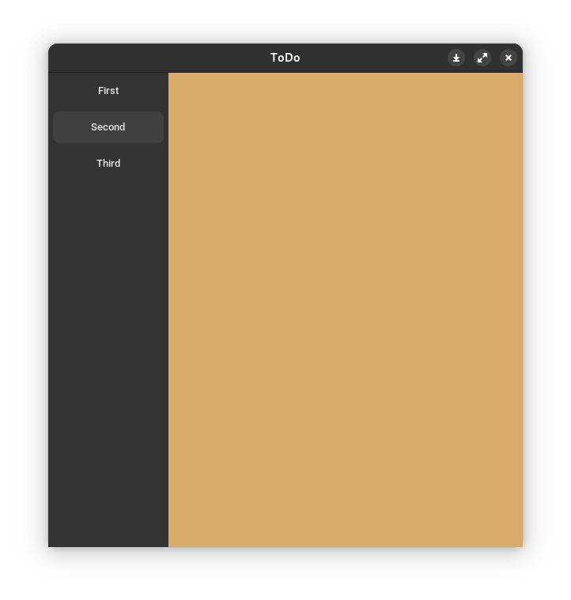
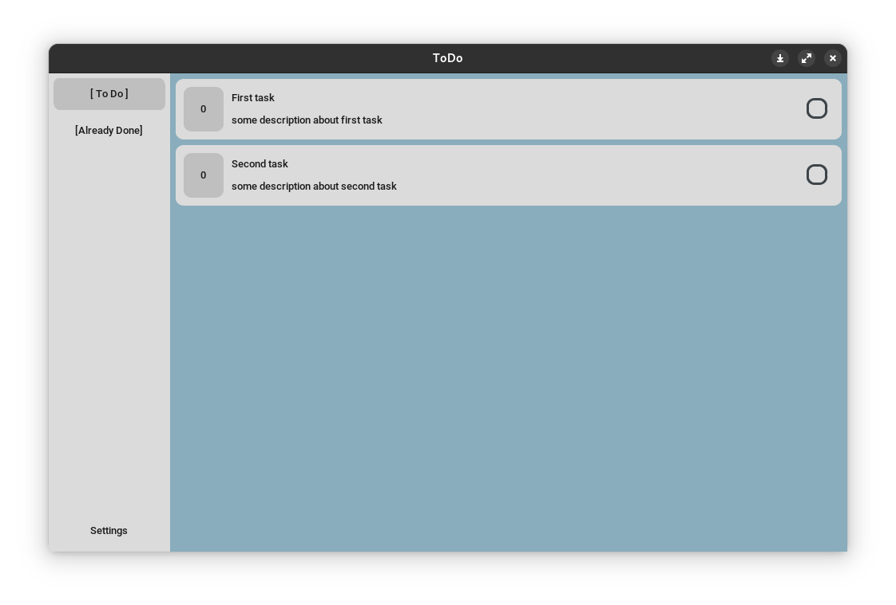
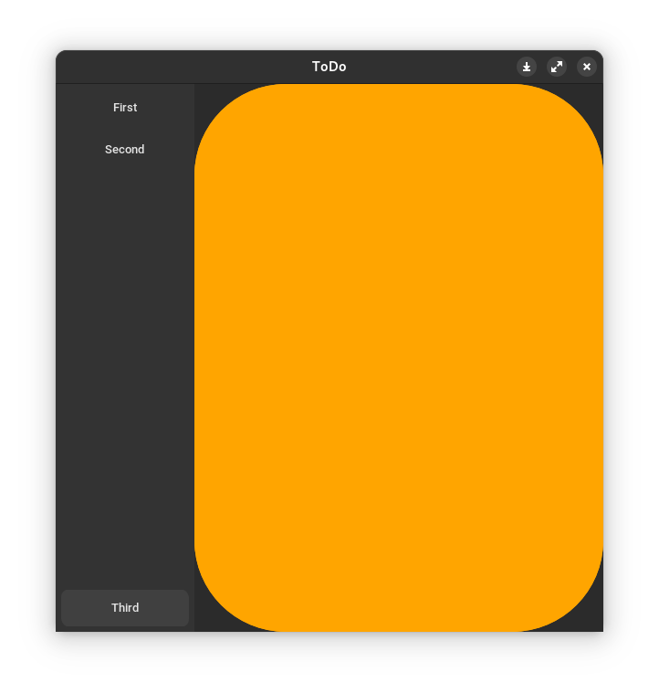

# ToDo
Simple customtkinter todo app

|           dark            |           light           |
|:-------------------------:|:-------------------------:|
|  |  |

# dev
- [ ] add new task
- [ ] delete task
- [ ] change task
- [ ] task storage
- [ ] finish the task before (datetime)
- [ ] task groups
- [ ] add custom theme
  - [ ] background image
- [ ] settings
  - [ ] appearance
  - [ ] scaling
  - [ ] load custom theme
- [ ] calendar
  - [ ] month calendar
  - [ ] week calendar


### The following modules for CustomTkinter were developed in the project
- CtkNavbar


### Example of using CtkNavbar
By default, a frame with a random color is added (helps to prototype your application). 
You can pass your own frame to CtkNavbar.

```python
import CtkNavbar
import customtkinter

app = customtkinter.CTk() 

nav = CtkNavbar(master=app, default_frame=3, end_buttons_count=1)
nav.add_page(button_text="First")
nav.add_page(button_text="Second")

custom_frame = customtkinter.CTkFrame(master=nav, fg_color="orange", corner_radius=100)
custom_btn = customtkinter.CTkButton(master=nav.sidebar_frame, text="Third", fg_color="green")
nav.add_page(btn=custom_btn, frame=custom_frame)

nav.grid(row=0, column=0, sticky="nsew")
```


Also, if there are a large number of frames, you can use the `CtkNavbar.render()` 
manual function to optimize the number of calls to the `CtkNavbar._render()` 
function and speed up your application
```python
import CtkNavbar
import customtkinter

app = customtkinter.CTk() 

nav = CtkNavbar(master=app, auto_render=False)
nav.add_page(button_text="1")
nav.add_page(button_text="2")
nav.render() # call render function once
nav.grid(row=0, column=0, sticky="nsew")

nav.add_page(button_text="3")
# add many pages here
nav.add_page(button_text="42")
nav.render() # call render function once
```

