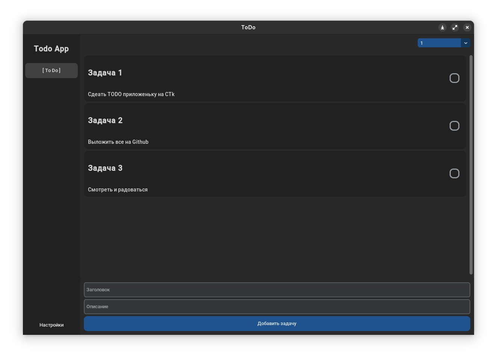
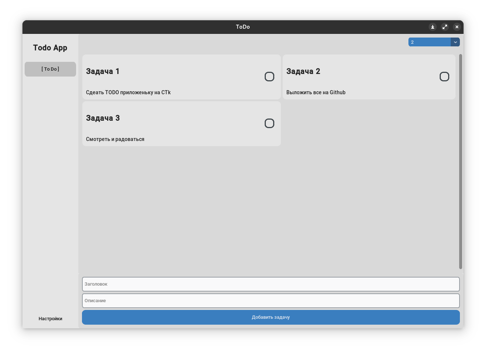

# ToDo
Simple customtkinter todo app

Use 2 widgets
- https://github.com/nkeff/CTkGridLayout/tree/main
- https://github.com/nkeff/CTkNavbar

|           dark            |           light           |
|:-------------------------:|:-------------------------:|
|  |  |


## Run app

``` commandline
git clone https://github.com/nkeff/CTkToDoApp
poetry update
poetry run ctktodoapp/ctk_todo_app.py
```


